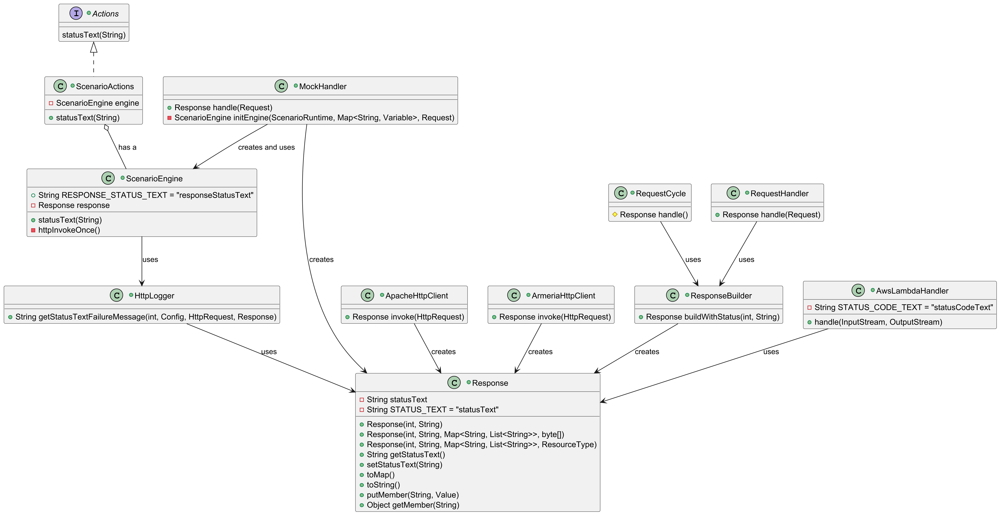

# Report for assignment 4

## Project

Name: karate

URL: https://github.com/karatelabs/karate

Description: Web-service testing framework

## [Onboarding experience](assignment/onboarding.md)

Due to our negative experiences with the previous repository chosen, we decided to switch repository for this assignment. After careful deliberation, we decided on the project Karate. 

### Karate

The onboarding for Karate (in our eyes) was pretty simple. It used Maven, which we had used for the previous assignments, so building the entire project was as easy as running a simple Maven command. The build times where a bit longer than for our previous projects, which was a bit tedious, but in the end it went smoothly and all tests passed.

Although we had never used Karate before, it was simple enough to get a surface-level understanding of what the project was for, which then helped when diving deeper into the project. However, the contribution guide was basically non-existent. The only information for potential contributors was what JDK versions are supported and that we should probably use an IDE (??). Some suggestions were made to use docker if one does not wish to install all the required tools on their host system, but other than these rather obvious pieces of information there was nothing else to help someone get started with contributing to the project.

Altering the project did not result in any issues, and all tests, along with those added, ran without issues. This was a welcome change from what we experienced in the previous assignment.

### Previous Onboarding (gson)

On the surface, the onboarding for the previous project—which in our case was gson—went smoothly. We had some previous experience with the repository, as we had used it for a previous assignment. It built quick, just took around 30 seconds. Not all tests passed, but we deemed it to be fine since the core-module passed. In hindsight, this was a red flag. This really indicated that there was a lot of dependencies and that small changes or different setups could make the build fail.

When we then started to alter the repo, several issues presented themselves, which we ultimately had to fix by disabling some of the more egregious requirements, and removing some dependencies which caused issues. The entire process was a pain, and ultimately the reason for why we decided to switch projects for this assignment.

## Effort spent

### David

- 1h: Meeting to discuss assignment
- 1h: Meeting to select repository and issue
- 0.5h: Issue selection: Trying to find a good issue
- 0.5h: Lab guidance session
- 1h: Issue selection: Compiling possible issues
- 1h: Meeting to discuss assignment progress
- 0.5h: Issue creation
- 1h: Watched UML class diagram tutorial
- 0.5h: Finding a tool that can generate UML class diagrams
- 1h: Project and GitHub repository coordination
- 1h: Creating UML class diagram
- 1h: PR reviews and UML class diagram creation
- 0.5h: UML class diagram creation
- 0.5h: Debugging UML generation (entire diagram did not fit in output)
- 1h: UML class diagram creation
- 1.5h: Meeting to discuss progress in assignment (also coordinate remaining tasks)
- 1h: Meeting to discuss description
- 0.5h: Finalizing UML diagram and writing associated README
- 0.5h: GitHub shenanigans (pushing own PR, reviewing other’s PRs)
- 0.5h: Documented onboarding experience and compared it with our previous experiences
- 0.5h: GitHub documentation, review and push
- 0.5h: Essence evaluation and reflection
- 1.5h: Confusing mess of different parts, description and SEMAT assessment
- 1h: Writing report according to template
- 0.5h: Discuss and add experience to report

### Francis

- 1.5h: Meeting to discuss assignment
- 1h: Meeting to select repository and issue
- 0.5h: Forking and installing maven, verifying that tests run
- 1.5h: Familiarizing with the repository
- 1.5h: Attempting “within” keyword issue
- 0.5h: Look at other possible issues.
- 2h: Attempting response time text issue
- 0.5h: Looking where the damn thing is actually tested
- 2h: Attempt to down-grade karate-demo to a version that supports responding with HTTP/1.1 status text (tomcat bad)
- 1h: Meeting to discuss assignment progress
- 1h: More attempts at downgrading demo project
- 1.5h: Meeting to discuss progress in assignment (also coordinate remaining tasks)
- 0.5h: Help with looking through tests
- 1h: Write about the general context of our changes
- 0.5h: GitHub documentation, review and push
- 0.5h: Essence evaluation and reflection
- 0.5h: Help with writing documentation
- 1.5h: Confusing mess of different parts, description and SEMAT assessment
- 1h: Writing report according to template
- 0.5h: Discuss and add experience to report

### Ebrar

- 1.5h: Meeting to discuss assignment
- 1h: Meeting to select repository and issue
- 0.5h: Forking and creating a suitable environment
- 2h: Familiarizing with the repository
- 0.5h: Video about API Testing for karate
- 1h: Experimenting with Karate features based on the video
- 1h: Trying to find official architecture diagram
- 1h: Finding relative documents as "Navigating the Brave New World of API Testing" for description of karate
- 1h: Write the description
- 0.5h: Worked on the pull request mishap and reverted a commit
- 1h: Look at other possible issues
- 1h: Improving description
- 2h: Reading karate documentation
- 1h: Improving the diagram and adding multiple information regarding the structure
- 1h: Meeting to discuss description
- 1h: Changing the description and adding examples of Karate usage
- 0.5h: GitHub documentation, review and push
- 0.5h: Essence evaluation and reflection
- 1h: Confusing mess of different parts, description and SEMAT assessment
- 1h: Writing report according to template
- 0.5h: Discuss and add experience to report

### Markus

- 1.5h: Meeting to discuss assignment
- 1h: Meeting to select repository and issue
- 1h: Meeting to discuss assignment progress
- 1.5h: Familiarizing with the code
- 1h: Identifying requirements
- 1h: Identified and wrote down requirements with descriptions
- 1h: Wrote project plan
- 1h: Improved project plan and requirements, cloned repository and made pr
- 0.5h: Worked on pull request mishap and separated it into 2 pull requests
- 0.5h: Discussed pull request and looked at other issues
- 1.5h: Meeting to discuss progress in assignment (also coordinate remaining tasks)
- 0.5h: Improving requirements documentation
- 1h: Reading karate documentation
- 2h: Reading and analyzing karate documentation
- 1h: PR commenting and looking for tests
- 1h: Discussed requirements.md and improved it
- 1h: Worked on documentation analysis
- 0.5h: GitHub documentation, review and push
- 0.5h: Essence evaluation and reflection
- 1h: Confusing mess of different parts, description and SEMAT assessment
- 1h: Writing report according to template
- 0.5h: Discuss and add experience to report

## Overview of issue(s) and work done.

Title: Get response status message

URL: https://github.com/karatelabs/karate/issues/2591

A user wanted to, beside getting the status code, also get the corresponding status text. This functionality did not exist.

### Scope

Scope of the project can be seen through the following UML class diagram. 

## [Requirements for the new feature or requirements affected by functionality being refactored](assignment/requirements.md)

### 1. Implement retrieve status text

When API testing you should be able to retrieve the status code but also the status message by implementing the getStatusText(). Formerly only the status code was obtainable. Now, for instance a status code like "400" should be accompanied by the status message linked to the status code based on the HTTP request like: "Gone" or "Not Found".

#### Test

Implement [testResponseStatusText](https://github.com/group-15-dd2480/Assignment-4/blob/90c085e6e2cad78c80dddc1ba32b5d5fdca8056b/karate-core/src/test/java/com/intuit/karate/core/MockHandlerTest.java#L193) for instance (a test to check that the correct status message gets returned based on different parameters).

### 2. Retain existing functionality.

Implementing the above requirements, specifically getStatusText() with tests should not break existing functionality. I.e everything should work as it did before plus the new functionality.

#### Test

No new test to ensure this but make sure the existing tests still works.

## Code changes

### Patch

You can get the patch by running, the patch is very clean.

git diff 34cb19f82fe43f61ecf4e4ed8876031cf464bd2f 83ecccabf01d7a9a23cfad92b851aa868cfc1fb7 

## Test results

No regression in existing functionality, all tests passed even after adding the feature, including the new tests we added. These new tests would not pass without the changes made.

Due to their non-standard way of testing, we did not include any logs.

## UML class diagram and its description

Since what we added was additional functionality to HTTP responses, the main class which the others connect to is the Response class. This was modified to add the functionality. However, this led to other classes needing changes to continue working. This meant using the new functionality in other classes, either to create Responses, or to retrieve information from responses, which is what the other classes in the diagram indicates.

## Overall experience

### [Essence](assignment/essence.md)

By our assessment we have once again reached stage 5: Working well from our previous assignment where we were at stage 3: In Use. We were in stage 5 previously, for the first assignment, at it was clear for everybody what was happening and what needed to be done. As the complexity of the assignments increased, we regressed, first to stage 4: In place, for the second assignment, and as mentioned previously, stage 3 for the third assignment. As we have gotten more diligent with planning the assignments, we have had fewer issues and higher productivity. For example, we spend much more time selecting a repository for this assignment than for the last assignment, this resulted in higher productivity as the number of issues encountered was decreased.

As we feel we are currently working well, there is no real obstacles for us to reach the next stage which is stage 6: Retired. Perhaps one obstacle could be that we are not finished with the assignment at the point of writing this.

Arguing about the benefits, drawbacks, and limitations of our work in the context of the SEMAT kernel, we can discuss the Work alpha. One drawback is that besides the repository owner and the one that made the issue, which can be seen as stakeholders, we also have the teachers and assistants grading our work. This includes additional tasks which is not directly beneficial to the other stakeholders. In this sense, the additional tasks we need to perform is detrimental for the open source contribution we are supposed to perform. One benefit of the additional tasks we need to perform is that they force us to better understand the requirements, which in turn is beneficial for the Work alpha. A limitation we have is the deadline. If we encounter delays, this might cause the work not to be finished, which to some extent is fine for the course stakeholders but not for the repo stakeholders, but also vice versa. We could focus on the work pertaining to the fix, or work pertaining to the assignment, but as we have more to lose on missing the expectations of our course stakeholders, inherently it is the repo stakeholders that will be negatively affected.

### Experience gained

As evidenced by the improvements in regards to the essence standard, we have indeed improved quite a bit from the previous projects. One of the experience gained has been more proficiency with the tools that have been common across all the assignments, such as GitHub, for example we have chosen to use the issue tracker to organize our work even through it was not explicitly required by the assignment.

As for more specific experience gained, we have gained more knowledge about how more advanced testing frameworks work, and how they can make certain tasks easier over just pure JUnit5 unit tests. For example the DSL that karate uses can make it easier for non-technical people to write tests. We have also gained more knowledge in how a big project can be structured, with multiple modules, instead of a very monolithic codebase.

We have also gained more insights into what is a bad example of contributor documentation, as our project had very lackluster documentation in that regards. So in some sense it has taught us the importance of such information as we had to struggle more to understand the code due to its absence.

### [Context](assignment/context.md)

There were no big architectural choices to be made, nor design patterns that we had to decide on ourselves. Our issue mainly revolved around implementing a "sister" feature to an already existing one, namely whenever we were dealing with status codes we had to add the functionality to also work with status text.

There are a few cases where a status code is hard-coded as a fallback, in these cases we had to choose an appropriate status text message. In these cases we use the de-facto accepted standard message for said status code, for example "OK" for 200, and "Not Found" for 404. In some cases, the web server does not return a status text message at all, such as in the case of tomcat 9, in these cases an empty value, or null, is acceptable. A note here through, the karate-demo sub-project, which is meant as a demo of using karate in a real project, uses tomcat 9 which is a shame since we cannot show any useful usage of our feature without downgrading the dependency. It is indeed very strange of the tomcat project to, by force, prevent people of using a feature of the HTTP/1.1 spec.

In addition to saving the returned status text message, we also need to introduce the accompanying expression in the DSL that karate uses, for example for status codes one can use the following expression to assert a certain response code `Then status 200`, we have to implement a similar expression for the text, which we have done like so `Then status text OK`. Since karate wants you to write tests in their DSL, without this addition the changes we made would have been useless. But again, this did not require us to make any big decisions as to the implementation of this feature, most of the implementations were very similar to other existing ones, and we simply substituted some variables for others.